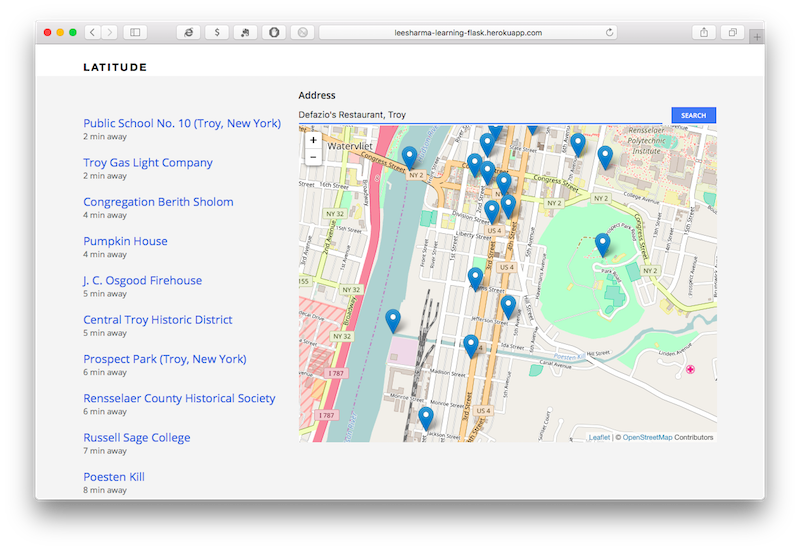

# Latitude

Latitude will let you enter a location-your home, workplace, or anywhere
else-and find notable places within walking distance. Sign up, enter an address,
and explore a map of interesting local attractions (with their associated
Wikipedia pages). Discover somewhere new with Latitude!

I made this app to help me learn Flask following the Lynda.com tutorial
[Learning Flask].

[Learning Flask]: https://www.lynda.com/Flask-tutorials/Learning-Flask/521231-2.html
